<div align="center">

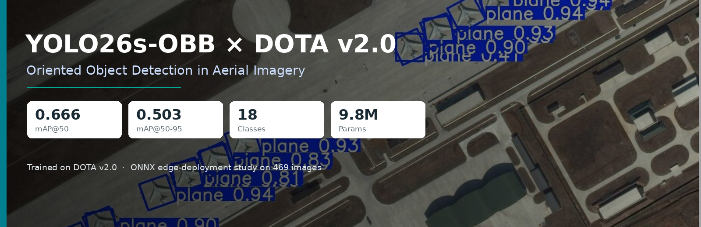

# YOLO26s-OBB × DOTA v2.0

### Oriented Object Detection in Aerial Imagery, with an Edge-Deployment Study

[](https://docs.ultralytics.com/)
[](https://captain-whu.github.io/DOTA/dataset.html)
[](#results)
[](#results)
[](LICENSE)

*Training and evaluating **YOLO26s-OBB** on **DOTA v2.0** (18 oriented classes), with a proxy study of inference speed as a step toward edge deployment.*

</div>

---

## Overview

This project trains Ultralytics' **YOLO26s-OBB** model on the **DOTA v2.0** aerial-imagery dataset for oriented object detection, analyses its behaviour class-by-class, and estimates its inference speed under different runtimes as a step toward edge deployment.

- Trained **YOLO26s-OBB** on DOTA v2.0 (all 18 oriented classes) at 1024×1024 on an NVIDIA A100.
- **mAP@50 = 0.666** / **mAP@50-95 = 0.503**, precision 0.776, recall 0.604 on the validation set (best epoch 43).
- **Per-class analysis** across all 18 categories, showing how the dataset's class imbalance maps directly onto detection accuracy.
- **Inference-speed study** on 469 test images under three runtimes (ONNX-GPU, ONNX-CPU, PyTorch-GPU) as a proxy for edge deployment.

> **Scope note.** The "edge" numbers below are **proxy measurements taken on a desktop with an RTX 3060**, using ONNX Runtime execution providers as stand-ins for edge devices — not measurements on physical Jetson or Raspberry Pi hardware. They are indicative upper bounds, and are labelled as such throughout. See [Edge-Deployment Study](#edge-deployment-study).

---

## Dataset — DOTA v2.0

<div align="center">

| 11,268 | 1.79 M | 18 | 1024² |
|:--:|:--:|:--:|:--:|
| Source images | Instances | Classes | Training tile size (px) |

</div>

[DOTA v2.0](https://captain-whu.github.io/DOTA/dataset.html) is one of the largest aerial-detection benchmarks, with **11,268 images** and **1,793,658 annotated instances** across **18 categories**. Its source images are very large (from roughly 800×800 up to ~20,000×20,000 px), so — following the standard DOTA workflow — they are **split into 1024×1024 tiles for training**. This project used a tiled DOTA v2.0 in YOLO-OBB 4-point format:

| Split | Tiles | Tile size |
|:--|:--:|:--:|
| Training | **17,521** | 1024 × 1024 |
| Validation | **5,305** | 1024 × 1024 |

At **inference time, full-size images are used directly** (not tiled), which is why the test images span a wide range of resolutions.

**The 18 classes:** plane, ship, storage-tank, baseball-diamond, tennis-court, basketball-court, ground-track-field, harbor, bridge, large-vehicle, small-vehicle, helicopter, roundabout, soccer-ball-field, swimming-pool, container-crane, airport, helipad.

DOTA v2.0 introduces three difficult categories over earlier versions — **airport, helipad and container-crane** — which makes it a stricter test of small- and rare-object detection.

---

## Why Oriented Boxes

<div align="center">

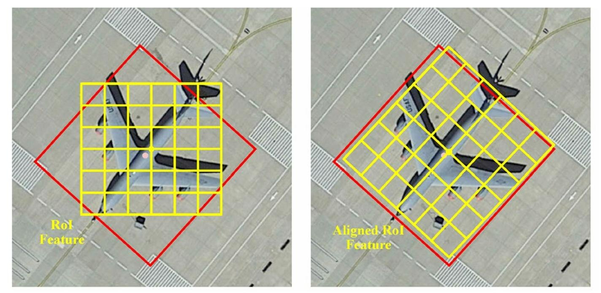

*Horizontal box (left) vs oriented box (right) on the same target.*

</div>

A **horizontal bounding box (HBB)** is axis-aligned: for a rotated ship or plane it overlaps neighbours and swallows background. An **oriented bounding box (OBB)** adds a rotation angle, wrapping each object tightly and cleanly separating dense neighbours — the natural representation for aerial imagery, and the focus of this work.

---

## Results

Trained for 150 target epochs (early-stopping patience 50); training ran to epoch 134 with the **best checkpoint at epoch 43**. All figures below come from the raw training log in [`results/raw/training_log.csv`](results/raw/training_log.csv).

<div align="center">

| Metric | Score |
|:------:|:-----:|
| **mAP@50** | **0.666** |
| **mAP@50-95** | **0.503** |
| **Precision** | **0.776** |
| **Recall** | **0.604** |

*Peak mean F1 = 0.65 at confidence 0.458.*

<br>

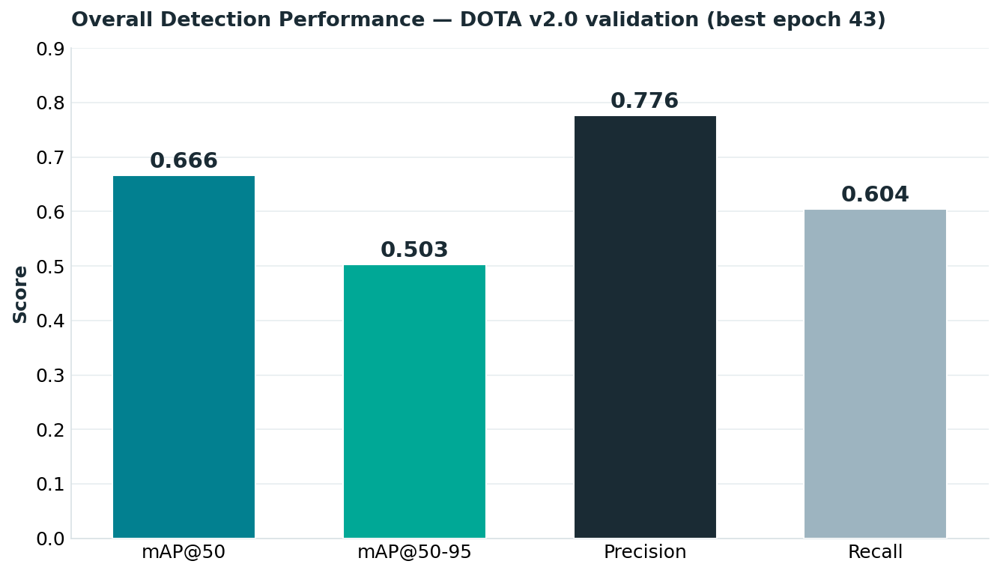

</div>

Precision higher than recall shows the model is **conservative**: when it makes a detection it is usually correct, but it misses some instances of the rarer categories — consistent with the class imbalance analysed below.

### Training progression

<div align="center">

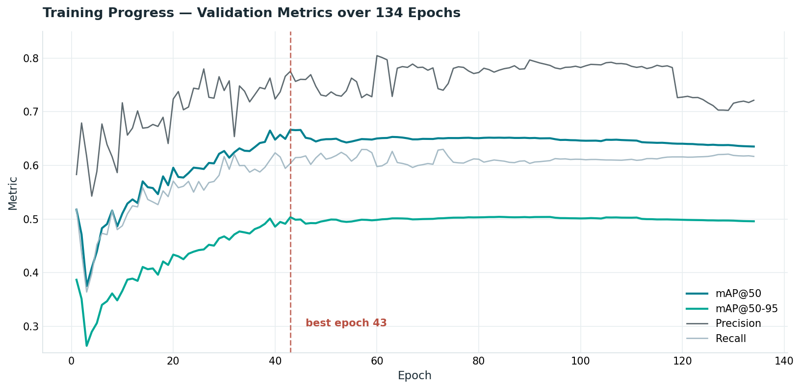

*Validation metrics over 134 epochs. mAP peaks around epoch 43, then plateaus — the early-stopping checkpoint is taken at the peak.*

</div>

### Evaluation curves

<div align="center">

| Precision–Recall | F1–Confidence |
|:--:|:--:|
| 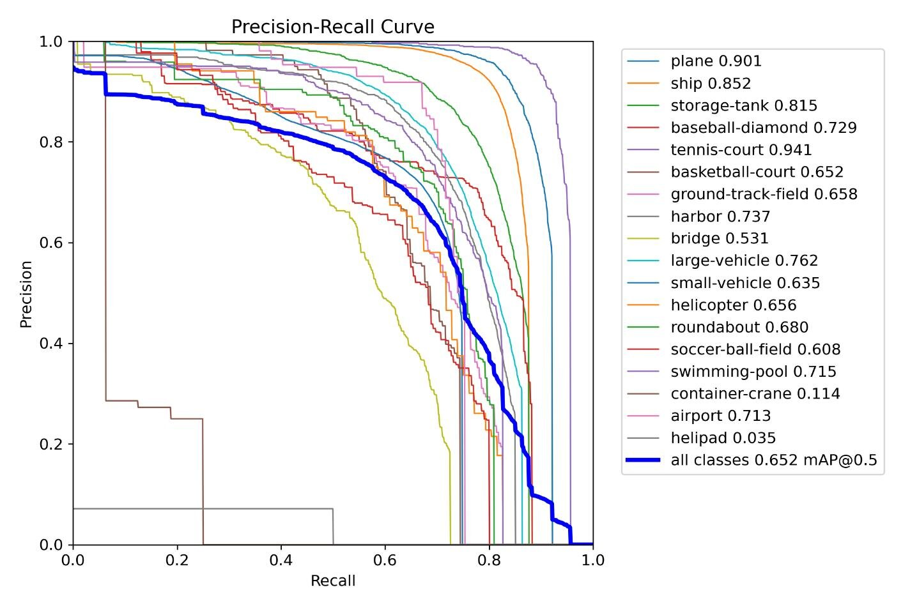 | 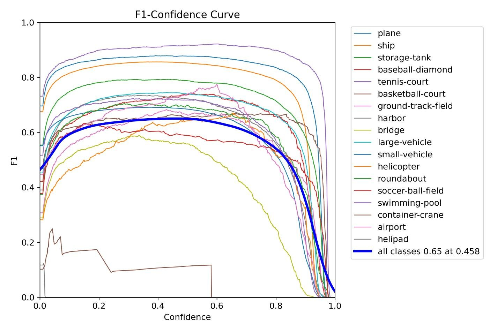 |
| **Confusion Matrix** | **Full training grid** |
| 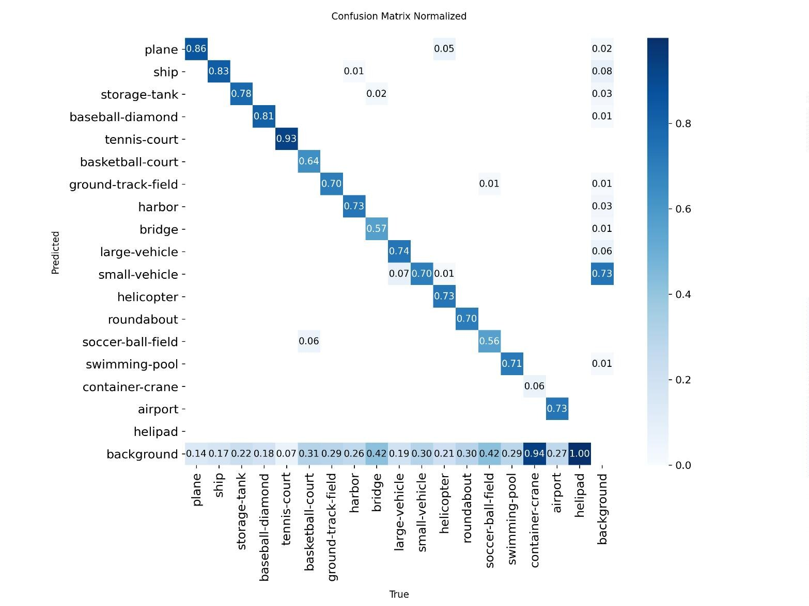 | 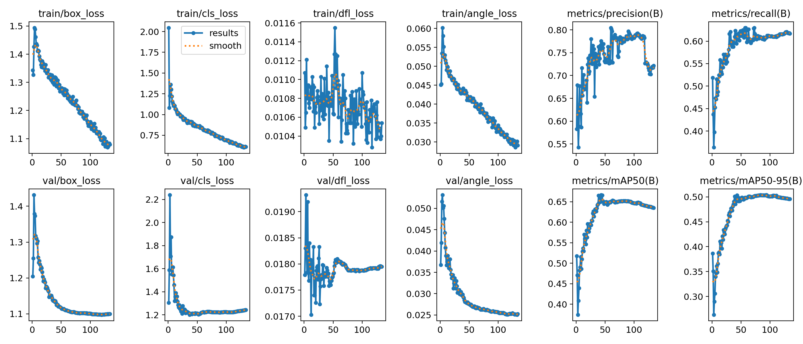 |

</div>

---

## Per-Class Analysis & Class Imbalance

The central finding: **detection accuracy tracks training-set frequency almost directly.** Well-represented, geometrically distinct classes excel; the rarest classes — newly introduced in v2.0 — are the clear weak points.

<div align="center">

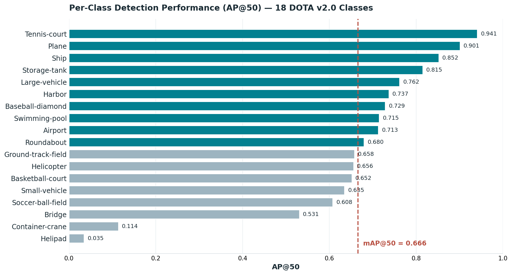

</div>

| Strongest classes | AP@50 | Weakest classes | AP@50 |
|:--|:--:|:--|:--:|
| Tennis-court | **0.941** | Helipad | 0.035 |
| Plane | **0.901** | Container-crane | 0.114 |
| Ship | **0.852** | Bridge | 0.531 |
| Storage-tank | **0.815** | Soccer-ball-field | 0.608 |

### The imbalance behind the numbers

DOTA v2.0 is heavily imbalanced, and that imbalance maps almost one-to-one onto the per-class results:

| | Class | Instances |
|:--|:--|:--:|
| **Most frequent** | Small-vehicle | 173,348 |
| **Least frequent** | Container-crane | 356 |

The two lowest scorers, **container-crane (0.114)** and **helipad (0.035)**, are precisely the categories starved of training examples. This points directly at **rare-class augmentation** as the single highest-value improvement for future work.

---

## Edge-Deployment Study

A detector is only useful on a UAV if it runs fast enough on the hardware available. To estimate this **without physical edge hardware**, the trained model was exported to **ONNX** and its inference speed measured on **469 DOTA v1.5 test images** (full-size, resized to 1024 internally) under three runtimes on a single desktop (**AMD Ryzen 9 / RTX 3060**). All numbers come from [`results/raw/deployment_summary.csv`](results/raw/deployment_summary.csv).

<div align="center">

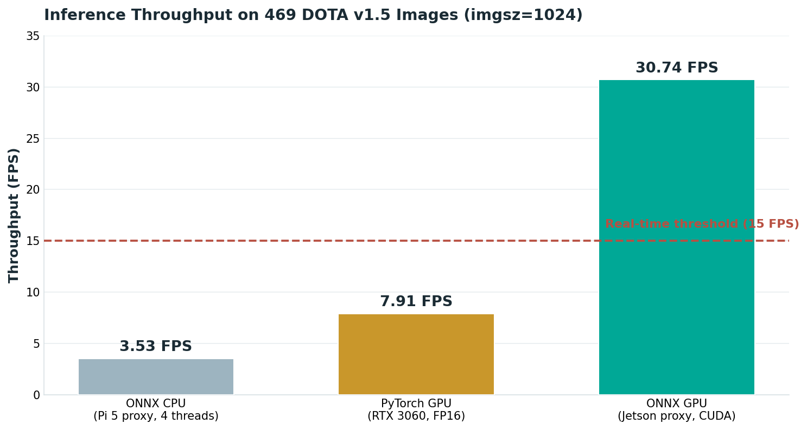

</div>

| Runtime | Stands in for | FPS | Avg Latency | Peak RAM | vs 15 FPS |
|:--|:--|:--:|:--:|:--:|:--:|
| **ONNX GPU (CUDA)** | Jetson-class accelerator | **30.7** | 32.5 ms | 1,000 MB | above |
| PyTorch GPU (FP16) | desktop baseline | 7.9 | 126.5 ms | — | below |
| ONNX CPU (4 threads) | Pi-class device | 3.5 | 283.6 ms | 722 MB | below |

<div align="center">

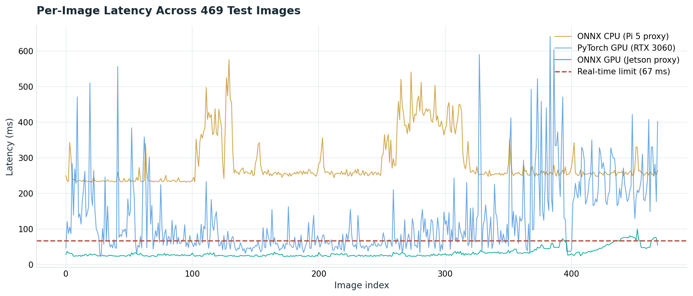

*Per-image latency across all 469 images, three runtimes, against the 67 ms real-time line.*

</div>

**How to read this — honestly:**
- These are **proxy measurements on a desktop**, not runs on a physical Jetson or Raspberry Pi. An RTX 3060 is more capable than a Jetson Orin Nano's GPU, so **the 30.7 FPS figure is an optimistic upper bound**, not a guarantee of on-device performance.
- What the study *does* show reliably: the **ONNX export runs, is memory-light** (≤1 GB), and the **ONNX-GPU path is ~4× faster than the same model under PyTorch** on identical hardware — a real, measured effect of the optimised inference graph.
- Confirming these numbers on physical hardware is listed under [Future Work](#future-work).

---

## Real Inference Output

The model was run over the 469 test images, producing **31,990 detections**. The distributions below are computed directly from that raw output ([`results/raw/inference_summary.csv`](results/raw/inference_summary.csv)).

<div align="center">

| Confidence distribution | Detected class distribution |
|:--:|:--:|
| 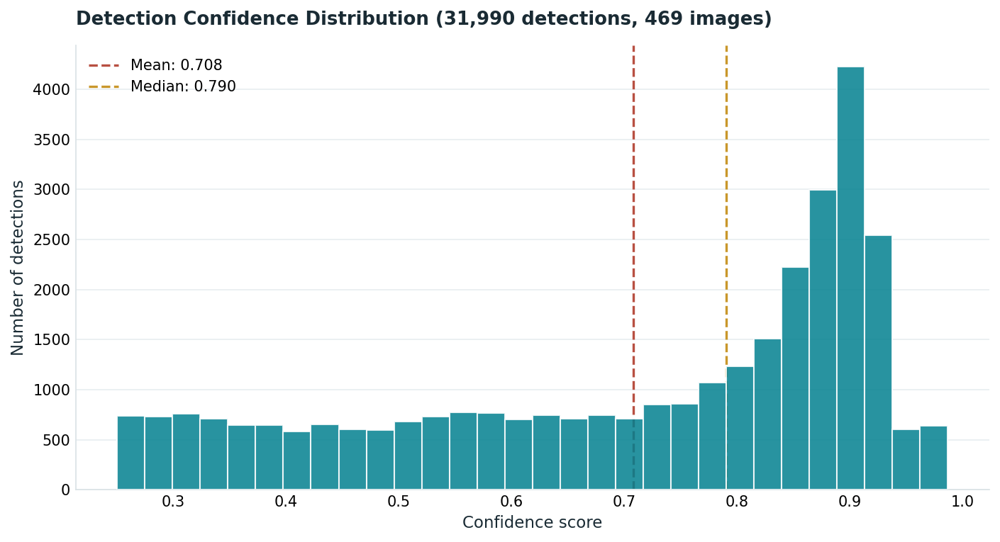 | 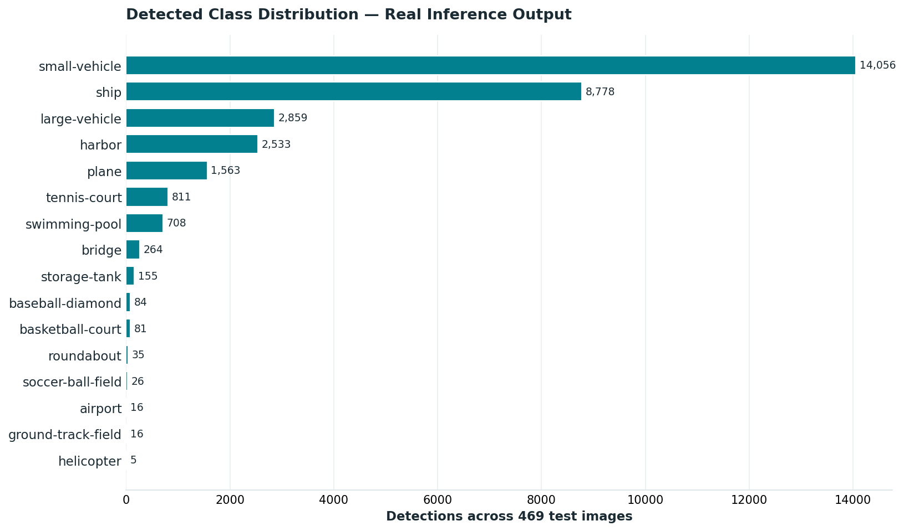 |

*Mean detection confidence 0.708; small-vehicle is by far the most frequently detected class — mirroring its dominance in the training data.*

</div>

### Qualitative detections

| Military airbase — dense aircraft | Naval harbor — multi-class |
|:--:|:--:|
| 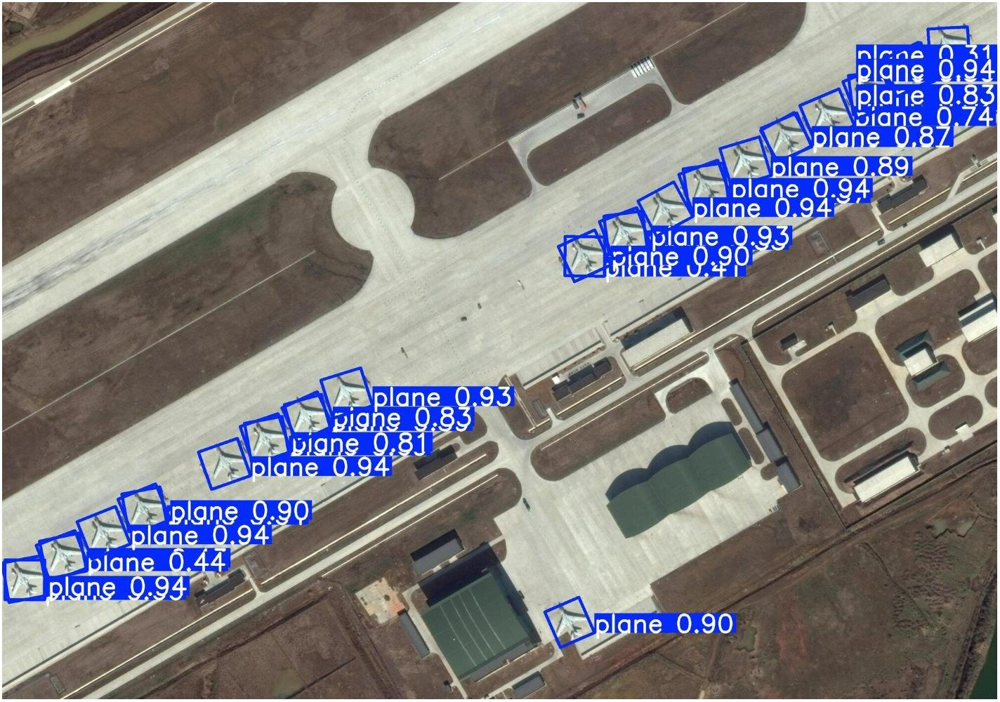 | 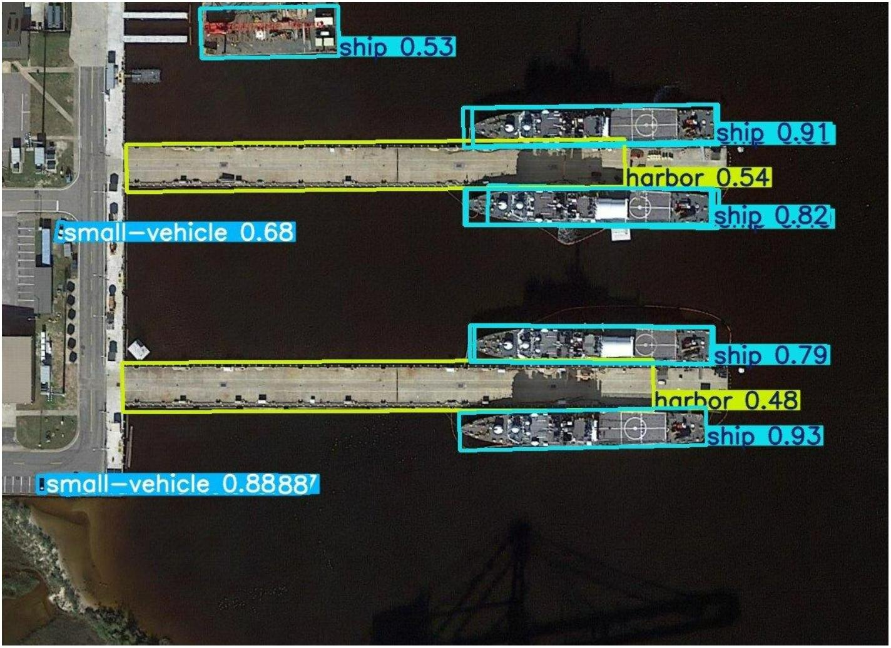 |
| **Sports complex** | **Mixed planes & vehicles** |
| 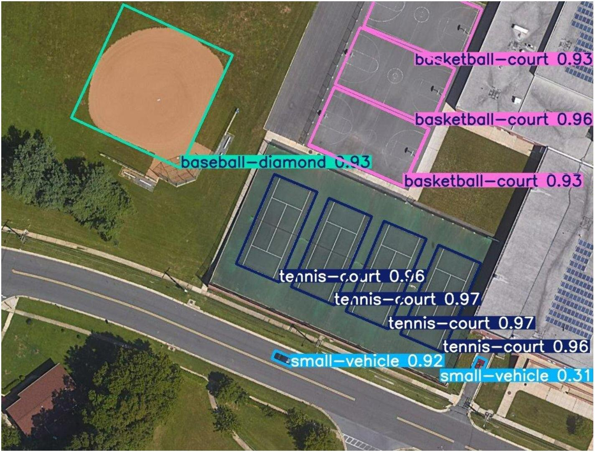 | 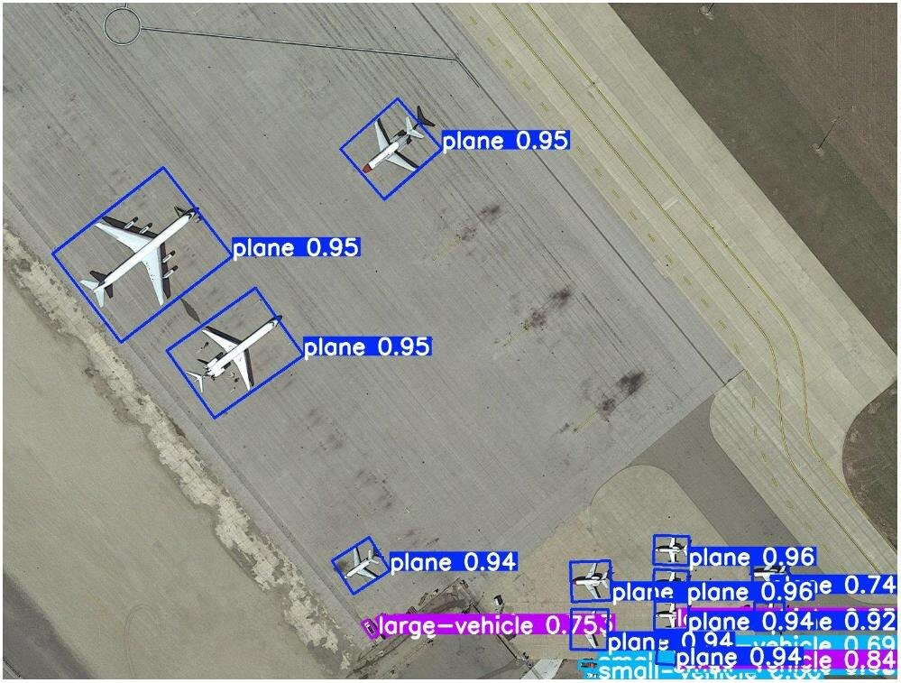 |

<details>
<summary><b>Failure cases (click to expand) — where the model struggles</b></summary>

<br>

Two characteristic failure modes, both linked to large scenes and small/edge objects:

**1. False positive — highway misread as airport**

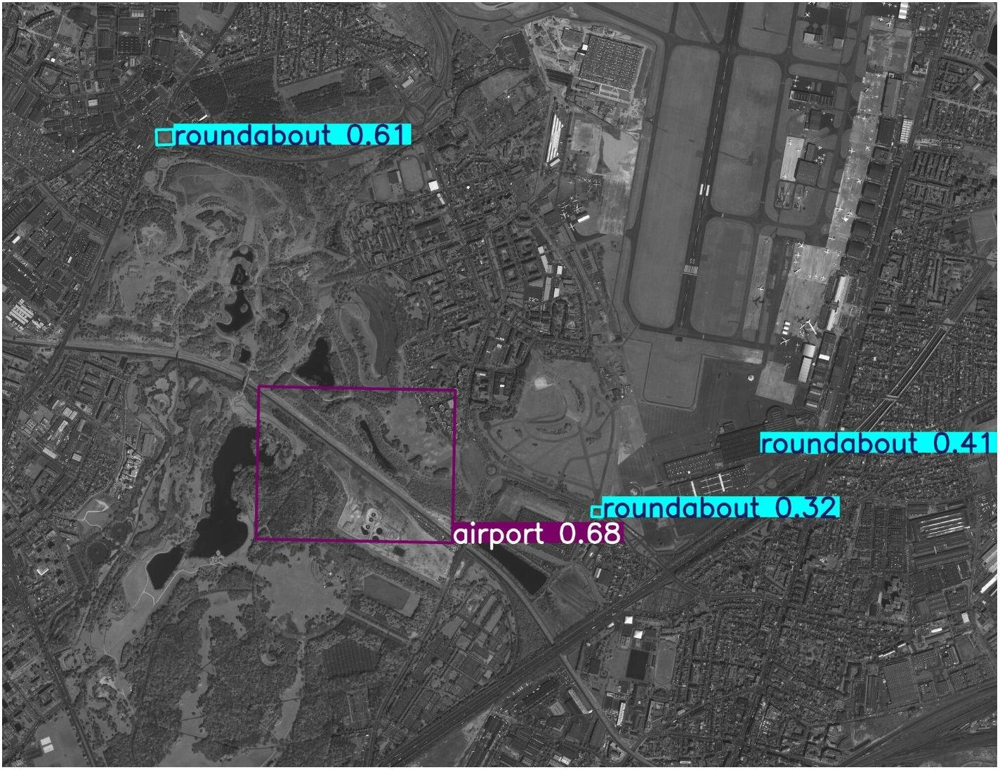

A stretch of highway is wrongly labelled `airport`; the real airport is at the image edge and lacks the full features needed for recognition. Roundabouts are still detected correctly.

**2. Under-detection — sparse harbor recall**

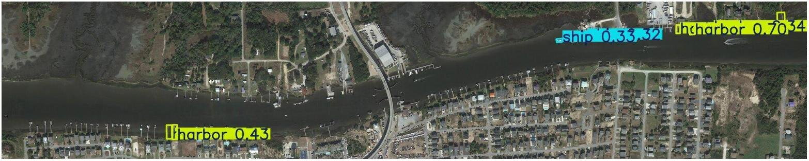

In a very wide river scene packed with harbor infrastructure, only a few instances are recovered. When the background dominates and objects are small relative to the frame, recall drops.

</details>

---

## The Model — YOLO26s-OBB

YOLO26 is Ultralytics' newest YOLO generation, designed for clean edge deployment:

- **NMS-free inference** — end-to-end detection with no Non-Maximum Suppression post-processing.
- **DFL-free head** — removes Distribution Focal Loss for a leaner, export-friendly graph.
- **STAL** — Small-Target-Aware Label assignment, improving tiny-object recall.
- **Lightweight** — the `s` variant is **9.8M params / 55.1 GFLOPs**, near the accuracy of far larger variants.

<div align="center">

| Variant | mAP@50 | mAP@50-95 | Params |
|:--|:--:|:--:|:--:|
| YOLO26n-obb | 78.9 | 52.4 | 2.5 M |
| **YOLO26s-obb** | **80.9** | **54.8** | **9.8 M** |
| YOLO26m-obb | 81.0 | 55.3 | 21.2 M |
| YOLO26l-obb | 81.6 | 56.2 | 25.6 M |
| YOLO26x-obb | 81.7 | 56.7 | 57.6 M |

*Reference numbers reported by the authors on DOTA v1 @ 1024px (Sapkota et al., 2026, preprint) — **not** this project's results. The `s` variant's accuracy/size balance is why it was chosen here.*

</div>

---

## Repository Structure

```
YOLO26-DOTA-v2/
├── docs/
│   ├── hero_banner.png
│   ├── METHODOLOGY.md          # full experimental setup & reproducibility
│   └── hbb_vs_obb.jpg
├── src/
│   ├── train.py                # training script (real config used)
│   ├── resume.py               # resume an interrupted run
│   ├── inference_gpu.py        # full-image inference + per-detection CSV logging
│   ├── benchmark_edge.py       # ONNX speed study across runtimes
│   ├── analyze_results.py      # charts from inference output
│   ├── analyze_edge_results.py # charts from the edge study
│   └── dota2_obb.yaml          # dataset config (18 classes)
├── results/
│   ├── raw/                    # the actual CSVs behind every number
│   │   ├── training_log.csv
│   │   ├── deployment_summary.csv
│   │   ├── inference_summary.csv
│   │   └── train_args.yaml
│   └── yolo26s-obb-dota2/      # generated charts & evaluation curves
├── examples/                   # annotated detections + failure cases
├── requirements.txt
└── README.md
```

Every headline number in this README is reproducible from the CSVs in [`results/raw/`](results/raw/).

---

## Try It Yourself

> **Model weights.** The trained `best.pt` and exported `best.onnx` are published under the repo's [Releases](../../releases) tab. Download them into the project root before running inference.

### Setup

```bash
git clone https://github.com/JustinVladut/YOLO26-DOTA-v2.git
cd YOLO26-DOTA-v2
pip install -r requirements.txt
```

### Run detection on your own aerial image

```bash
# Ultralytics CLI
yolo obb predict model=best.pt source="path/to/your_image.jpg" imgsz=1024 save=True
```

```python
# Or in Python, with per-detection detail
from ultralytics import YOLO
model = YOLO("best.pt")
for r in model.predict(source="your_image.jpg", imgsz=1024, conf=0.25, save=True):
    for box in r.obb:
        print(f"{model.names[int(box.cls)]:18s} conf={float(box.conf):.2f}")
```

### Measure inference speed on your hardware

```bash
python src/benchmark_edge.py            # edit the paths at the top first
```

### Reproduce the full pipeline

Retraining needs the tiled [DOTA v2.0 dataset](https://captain-whu.github.io/DOTA/dataset.html) and a capable GPU. See [`docs/METHODOLOGY.md`](docs/METHODOLOGY.md) for the exact configuration.

```bash
python src/train.py                     # trains YOLO26s-OBB (config as used here)
python src/inference_gpu.py             # full-image inference + CSV logs
python src/analyze_results.py           # regenerate inference charts
```

---

## Future Work

- **On-device validation** — confirm the ONNX speed numbers on a physical Jetson Orin Nano and Raspberry Pi 5, replacing the desktop proxy.
- **Rare-class augmentation** — targeted oversampling for helipad and container-crane.
- **INT8 quantization** — to push the CPU runtime toward real time.
- **Tiled inference (SAHI)** — run detection on tiles of large images to fix the edge-cut failure mode.

---

## Acknowledgements

- The [DOTA](https://captain-whu.github.io/DOTA/) team (Wuhan University) for the dataset.
- [Ultralytics](https://docs.ultralytics.com/) for the YOLO26 framework.
- Sapkota et al. (2026) for the YOLO26 architecture (preprint, arXiv:2509.25164).

---

## License

Released under the [MIT License](LICENSE).
